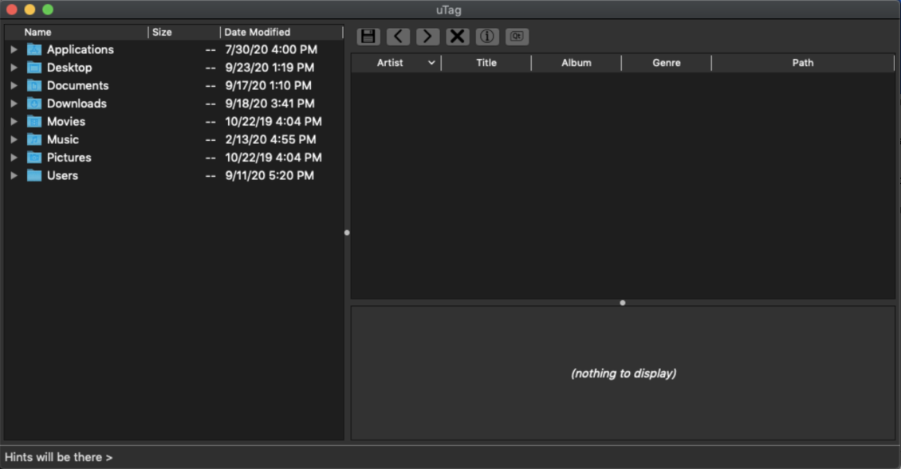

# utag
### Developers:
[Yuri Burienkov](https://github.com/ronald112)

### Installation:
>1. git clone https://github.com/ronald112/utag.git
>2. cmake . -Bbuild -Wdev -Werror=dev && cmake --build ./build
>3. enjoy!

### Description:
This is a program to edit audio tags for MACOS. It developed using [qt5](https://github.com/qt/qt5) and [taglib](https://github.com/taglib/taglib) frameworks.

### Features
Works with various of audio extensions: mp3|ogg|oga|mogg|flac|mpc|wav|mp4|asf|tta|aiff|spx|wv. Display audio image. Can edit artist, title, album, genre, filePath, year, track, comment. Can open directory with audio files through terminal and gui.

### Shortcuts
<ul>
  <li>Save: Cmd + S</li>
  <li>Undo: Cmd + Z</li>
  <li>Redo: Cmd + Y</li>
  <li>Quit: Cmd + Q</li>  
</ul>

--------

